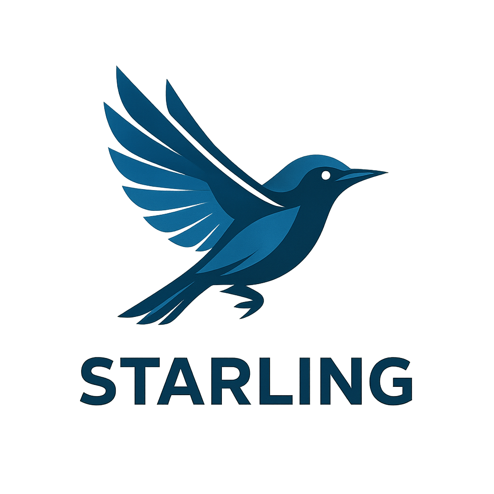

    

Starling is a fast, lightweight distributed state-sharing system, written in Go. It uses the RAFT consensus algorithm to reliably synchronize values and state across applications and services. Designed for simplicity, speed, and cloud-native environments, Starling makes it easy to coordinate distributed workloads and share configuration or ephemeral state with minimal overhead.
